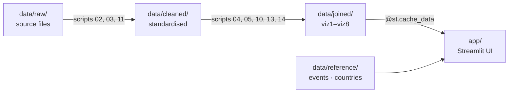

<div align="center">

# The Tariff Tax — Who Pays?

### A data narrative for the 47th President of the United States


</div>

---

<div align="center">

### The same policy. A **3.2×** gap in who pays for it.

**Bottom 10%** loses **1.14%** of income · **Top 10%** loses **0.36%**

</div>

<div align="center">

[**▶ Try the Dashboard**](#try-it-in-60-seconds) · [**The Four Acts**](#the-story--in-four-acts) · [**Why This Arc**](#why-this-arc) · [**Credits**](#credits)

_Live Streamlit Cloud URL pending — local run fully supported below._

</div>

---

## The numbers

<div align="center">

| **20.2%** | **$364 B** | **83 K** | **3.2×** |
|:---:|:---:|:---:|:---:|
| peak tariff rate | customs revenue | mfg jobs lost | decile burden gap |
| _century-high_ | _single year_ | _YTD 2025_ | _bottom vs top 10%_ |

</div>

---

## The story — in four acts

<div align="center">

| **ACT I** | **ACT II** ← core | **ACT III** | **ACT IV** |
|:---|:---|:---|:---|
| The Scale | **Who Pays** | What It Bought | The Choice |
| _How big?_ | _Is it fair?_ | _At what cost?_ | _What next?_ |
| Tariff × markets × events on one timeline | Income lost by decile — two scenarios | Promises vs. outcomes scorecard | What-If slider + yield curve |
| awe · shock | empathy · anger | complexity · honesty | urgency · decision |

</div>

A single-page vertical scroll. Act II is the pivot; everything else sets it up or follows from it.

---

## Try it in 60 seconds

```bash
git clone https://github.com/tooichitake/tariff-story.git
cd tariff-story
pip install -r requirements.txt
python run.py
```

Opens at **http://localhost:8501**. Requires Python 3.10+.

---

## Why this arc

> The arc ends with prescription, not exploration — exactly what a 98-day decision demands.

| Narrative arc | Verdict for this audience |
|---|---|
| **What → So What → What Next** ← chosen | Briefing-paced, prescription at the end — matches how the President reads |
| Martini Glass | Sandbox ending wastes the urgency built across three acts |
| Detective | Requires a genuine unknown; the tariff facts are public |
| Sparkline | Collapses four distinct gaps into one; hides the core insight |

The emotional gradient — _awe → empathy → complexity → urgency_ — raises the stakes so Act IV lands on a reader who is informed, not surprised. Stakeholder persona in [`docs/persona.md`](docs/persona.md).

---

## Architecture

```
app/          Streamlit UI — app.py + four act modules + hook
data/         raw → cleaned → joined → reference
scripts/      Portable pipeline (01–14) using Path(__file__)
.streamlit/   Config read by Streamlit Cloud at repo root
docs/         Stakeholder persona + user stories
```



---

## Datasets

Ten viz-ready CSVs in `data/joined/`, grouped by narrative act. Every file carries a `source` column. All dates `YYYY-MM-DD`; country codes ISO 3166 alpha-3.

<div align="left">

**Act I — Timeline & Map**
`viz1_tariff_market_fear` · `viz6_animated`

**Act II — Distributional Burden**
`viz3_who_pays` _(central)_ · `viz2_price_pass_through`

**Act III — Trade-offs**
`viz4_deficit_paradox` · `viz5_manufacturing_tradeoff` · `viz6_world_map` · `viz6_consumer_map`

**Act IV — Scenarios & Signals**
`viz7_whatif` · `viz8_recession_signal`

**Reference** · `key_events.csv` · `country_mapping.csv`

</div>

---

## Reproducing the pipeline

Scripts are cross-platform — they use `Path(__file__)` so cloning anywhere works without editing paths.

```bash
python scripts/02_download_fred.py             # FRED series via HTTP
python scripts/03_download_yale_kaggle.py      # Yale Budget Lab + Kaggle
python scripts/04_clean_all_data.py            # FRED + Yale + Kaggle standardise
python scripts/05_create_joins.py              # viz1 · 2 · 4 · 5 · 6 · 8
python scripts/10_clean_dfat_gold.py           # DFAT pivot + gold
python scripts/11_download_gta_alternatives.py # tradewartracker + White House
python scripts/13_integrate_gta.py             # enrich daily tariff + world map
python scripts/14_rebuild_data.py              # viz3 deciles + viz6 animated
```

`scripts/03` needs Kaggle credentials at `~/.kaggle/kaggle.json`. `scripts/10` reads the bundled 17 MB DFAT XLSX at `data/raw/australia/` — the only raw file committed, because its source requires a browser download. All other raw data is excluded by `.gitignore` since the scripts re-fetch it.

---

## Deployment — Streamlit Cloud

| Step | Action |
|:---:|---|
| **1** | `git push origin main` |
| **2** | Visit **share.streamlit.io** → click **Create app** |
| **3** | Pick repo & branch · main file: `app/app.py` · Python: 3.11 |
| **4** | Click **Deploy** — build takes 2–4 min, URL returned |

---

## Troubleshooting

| Symptom | Fix |
|---|---|
| `ModuleNotFoundError: streamlit` | `pip install -r requirements.txt` in the active environment |
| `Address already in use` on 8501 | `streamlit run app/app.py --server.port 8502` |
| Charts empty | Rebuild: re-run the pipeline from `scripts/02` onward |

---

## Credits

### Data

**Federal Reserve (FRED)** · **Yale Budget Lab** · **Tax Policy Center** · **Kaggle** · **Kratosfury/Tariffs-USA** · **tradewartracker/trade-war-redux-2025** · **DFAT Australia** · **US Census** · **BLS** · **BEA**

### Images

All imagery is Public Domain or CC-licensed, sourced from Wikimedia Commons. No Getty / AP / Reuters. Full attribution in [`app/assets/images/LICENSE.md`](app/assets/images/LICENSE.md).

### Code


### Fonts & icons

**Playfair Display** · **Inter** — SIL OFL 1.1 · **[Lucide](https://lucide.dev)** — ISC · inline SVG icons

---

## License

Data and media remain with their original publishers under their respective licences. See [`app/assets/images/LICENSE.md`](app/assets/images/LICENSE.md) for image provenance and the _Credits_ section above for code, font, and data licences.
