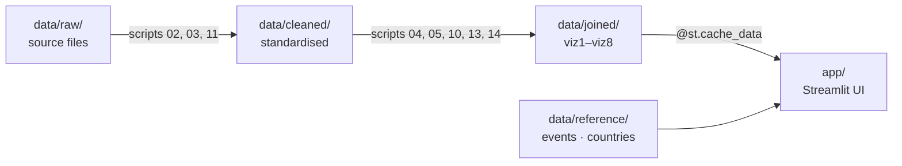

<div align="center">

# The Tariff Tax — Who Pays?

### A data narrative for the 47th President of the United States


</div>

---

<div align="center">

### The same policy. A **3.2×** gap in who pays for it.

**Bottom 10%** loses **1.14%** of income · **Top 10%** loses **0.36%**

</div>

<div align="center">

[**▶ Open the Live Dashboard**](https://tariff-story-aiyn2bq24wdbgt8sojd3ev.streamlit.app) · [**The Four Acts**](#the-story--in-four-acts) · [**Data Dictionary**](#data-dictionary) · [**Credits**](#credits)

_Hosted on Streamlit Community Cloud · local run instructions below._

</div>

---

## The numbers

<div align="center">

| **30.2%** | **$364 B** | **82 K** | **3.2×** |
|:---:|:---:|:---:|:---:|
| peak tariff rate | customs revenue | mfg jobs lost | decile burden gap |
| _century-high_ | _annualized, Q4 2025_ | _since Jan 2025_ | _bottom vs top 10%_ |

</div>

---

## The story — in four acts

<div align="center">

| **ACT I** | **ACT II** ← core | **ACT III** | **ACT IV** |
|:---|:---|:---|:---|
| The Scale | **Who Pays** | What It Bought | The Choice |
| _How big?_ | _Is it fair?_ | _At what cost?_ | _What next?_ |
| Tariff × markets × events on one timeline | Income lost by decile — two scenarios | Promises vs. outcomes scorecard | What-If slider + yield curve |
| awe · shock | empathy · anger | complexity · honesty | urgency · decision |

</div>

A single-page vertical scroll. Act II is the pivot; everything else sets it up or follows from it.

---

## Try it in 60 seconds

**Live** → **<https://tariff-story-aiyn2bq24wdbgt8sojd3ev.streamlit.app>**

**Local** —

```bash
git clone https://github.com/tooichitake/tariff-story.git
cd tariff-story
pip install -r requirements.txt
python run.py
```

Opens at **http://localhost:8501**. Requires Python 3.10+.

---

## Why this arc

> The arc ends with prescription, not exploration — exactly what a 98-day decision demands.

| Narrative arc | Verdict for this audience |
|---|---|
| **What → So What → What Next** ← chosen | Briefing-paced, prescription at the end — matches how the President reads |
| Martini Glass | Sandbox ending wastes the urgency built across three acts |
| Detective | Requires a genuine unknown; the tariff facts are public |
| Sparkline | Collapses four distinct gaps into one; hides the core insight |

The emotional gradient — _awe → empathy → complexity → urgency_ — raises the stakes so Act IV lands on a reader who is informed, not surprised. Stakeholder persona in [`docs/persona.md`](docs/persona.md).

---

## Architecture

```
app/          Streamlit UI — app.py + four act modules + hook
data/         raw → cleaned → joined → reference
scripts/      Portable pipeline (01–15) using Path(__file__)
.streamlit/   Config read by Streamlit Cloud at repo root
docs/         Stakeholder persona + user stories
```


```mermaid
flowchart LR
    A["data/raw/<br/>source files"] -->|"scripts 02, 03, 11"| B["data/cleaned/<br/>standardised"]
    B -->|"scripts 04, 05, 10, 13, 14"| C["data/joined/<br/>viz1–viz8"]
    C -->|"@st.cache_data"| D["app/<br/>Streamlit UI"]
    E["data/reference/<br/>events · countries"] --> D
```

---

## Datasets

Ten viz-ready CSVs in `data/joined/`, grouped by narrative act. All dates `YYYY-MM-DD`; country codes ISO 3166 alpha-3. Inline provenance lives on `viz1` and `viz7`; the rest inherit provenance from the [Data Dictionary](#data-dictionary) below.

<div align="left">

**Act I — Timeline & Map**
`viz1_tariff_market_fear` · `viz6_animated`

**Act II — Distributional Burden**
`viz3_who_pays` _(central)_ · `viz2_price_pass_through`

**Act III — Trade-offs**
`viz4_deficit_paradox` · `viz5_manufacturing_tradeoff` · `viz6_world_map` · `viz6_consumer_map`

**Act IV — Scenarios & Signals**
`viz7_whatif` · `viz8_recession_signal`

**Reference** · `key_events.csv` · `country_mapping.csv`

</div>

---

## Data Dictionary

Column-level schema for every shipping CSV. Type follows pandas conventions (`int64`, `float64`, `str`, `bool`). Provenance points to the upstream source — the [Dataset Inventory](Instructions.md#dataset-inventory) in `Instructions.md` carries the file-path lineage.

<details>
<summary><b>viz3_who_pays.csv</b> — Act II central · 20 rows · Yale Budget Lab Feb 2026</summary>

| Column | Type | Unit | Description | Source |
|---|---|---|---|---|
| `decile` | int64 | 1–10 | Income decile, 1 = poorest 10%, 10 = richest 10% | Yale TBL Feb 2026 |
| `decile_label` | str | — | Human label, e.g. `Decile 1` | derived |
| `scenario` | str | — | `Current Policy (S122)` or `IEEPA Upheld` | Yale TBL Feb 2026 |
| `pct_income_lost` | float64 | % of income | Annual share of income lost to tariffs | Yale TBL F5 sheet |
| `usd_cost` | float64 | USD / household / yr | Average annualized dollar burden per household | Yale TBL F5 sheet |
| `most_affected_goods` | str | — | Top categories driving the decile's loss | Yale narrative |

</details>

<details>
<summary><b>viz1_tariff_market_fear.csv</b> — Act I · 936 rows · daily, 2024-01-01 → 2026-07-24</summary>

| Column | Type | Unit | Description | Source |
|---|---|---|---|---|
| `date` | str | YYYY-MM-DD | Trading-day date | — |
| `eff_tariff_rate` | float64 | % | Import-weighted effective tariff rate | tradewartracker daily (Jan–Jun 2025) + `key_events` step function thereafter |
| `tariff_source` | str | — | `tradewartracker_daily` \| `key_events_step` (provenance per row) | derived |
| `sp500` | float64 | index | S&P 500 close | FRED `SP500` |
| `vix` | float64 | index | CBOE Volatility Index close | FRED `VIXCLS` |
| `event_short` | str | — | Event label on event days (else NaN) | `key_events.csv` |
| `impact_type` | str | — | `tariff_up` \| `tariff_down` \| `retaliation` \| `legal` \| `negotiation` \| `threat` | `key_events.csv` |
| `story_act` | str | — | `I` \| `II` \| `III` \| `IV` | `key_events.csv` |
| `is_event` | bool | — | `True` on event days | derived |

</details>

<details>
<summary><b>viz2_price_pass_through.csv</b> — Act II · 26 rows · monthly</summary>

| Column | Type | Unit | Description | Source |
|---|---|---|---|---|
| `date` | str | YYYY-MM-01 | First-of-month timestamp | — |
| `eff_tariff_rate` | float64 | % | Monthly effective tariff rate | tradewartracker / key_events |
| `cpi` | float64 | index 1982-84=100 | Consumer Price Index, all items | FRED `CPIAUCSL` |
| `cpi_pct_change` | float64 | % MoM | Month-over-month CPI percent change | derived |
| `consumer_sentiment` | float64 | index | Michigan Consumer Sentiment | FRED `UMCSENT` |

</details>

<details>
<summary><b>viz4_deficit_paradox.csv</b> — Act III · 26 rows · monthly</summary>

| Column | Type | Unit | Description | Source |
|---|---|---|---|---|
| `date` | str | YYYY-MM-01 | First-of-month timestamp | — |
| `eff_tariff_rate` | float64 | % | Monthly effective tariff rate | tradewartracker / key_events |
| `trade_balance` | int64 | USD millions | Monthly US goods + services trade balance | FRED `BOPGSTB` |

</details>

<details>
<summary><b>viz5_manufacturing_tradeoff.csv</b> — Act III · 26 rows · monthly</summary>

| Column | Type | Unit | Description | Source |
|---|---|---|---|---|
| `date` | str | YYYY-MM-01 | First-of-month timestamp | — |
| `eff_tariff_rate` | float64 | % | Monthly effective tariff rate | tradewartracker / key_events |
| `industrial_prod` | float64 | index 2017=100 | Industrial production | FRED `INDPRO` |
| `unemployment` | float64 | % | Headline U-3 unemployment rate | FRED `UNRATE` |
| `mfg_employment` | int64 | thousands | Manufacturing payroll employment | FRED `MANEMP` |
| `mfg_job_openings` | int64 | thousands | JOLTS manufacturing job openings | FRED `JTS3000JOL` |

</details>

<details>
<summary><b>viz6_world_map.csv</b> · <b>viz6_animated.csv</b> · <b>viz6_consumer_map.csv</b> — Acts I & III · country level</summary>

**`viz6_animated.csv`** — 1,155 rows (date × country), drives Act I choropleth.

| Column | Type | Unit | Description | Source |
|---|---|---|---|---|
| `date_str` | str | YYYY-MM-DD | Frame timestamp for Plotly `animation_frame` | — |
| `country_name` | str | — | Country name (uppercase) | tradewartracker |
| `iso3` | str | ISO 3166 alpha-3 | Country code | `country_mapping.csv` |
| `effective_tariff` | float64 | % | Country-level effective US tariff that day | tradewartracker + White House |
| `total_imports` | float64 | USD | Annual US imports from country | US Census FT900 |
| `tariff_2024` | float64 | % | 2024 baseline tariff (pre-Trump-II) | tradewartracker |

**`viz6_consumer_map.csv`** — 57 rows, Act III "who supplies the goods hit hardest" expander.

| Column | Type | Unit | Description | Source |
|---|---|---|---|---|
| `iso3` · `country_name` | str | — | Country code + name | `country_mapping.csv` |
| `total_consumer_imports_bn` | float64 | USD billions | Consumer-goods imports from country | tradewartracker HS2 files |
| `weighted_tariff_increase` | float64 | pp | Import-weighted tariff increase on consumer goods | derived (`scripts/13`) |
| `top_goods_affected` | str | — | Top 3 categories with tariff delta, e.g. `Electronics (+27%); …` | derived |

**`viz6_world_map.csv`** — 77 rows, reserved snapshot (current app renders the animated variant). Canonical columns: `iso3`, `country`, `tariff_rate_final`, `exports_bn`, `imports_bn`, `trade_deficit_bn`. Duplicate `*_x` / `*_y` columns are merge artefacts and unused.

</details>

<details>
<summary><b>viz7_whatif.csv</b> — Act IV · 5 rows · policy scenarios</summary>

| Column | Type | Unit | Description | Source |
|---|---|---|---|---|
| `scenario` | str | — | Policy path label (e.g. `Let S122 expire (Jul 24)`) | author |
| `eff_tariff_rate` | float64 | % | Effective US tariff under scenario | Yale / TPC |
| `gdp_impact_pct` | float64 | % GDP | 10-yr cumulative GDP impact | Yale / TPC |
| `unemployment_increase_pp` | float64 | pp | Unemployment-rate change | Yale / TPC |
| `price_increase_pct` | float64 | % | Headline price-level increase | Yale / TPC |
| `household_cost_bottom20_usd` | int64 | USD / yr | Annual cost to bottom-quintile household | Yale / TPC |
| `household_cost_top20_usd` | int64 | USD / yr | Annual cost to top-quintile household | Yale / TPC |
| `tariff_revenue_10yr_trillion` | float64 | USD trillions | 10-yr cumulative revenue | Yale / TPC |
| `source` | str | — | Citation, e.g. `Yale/TPC`, `Yale Nov 2025` | inline |

</details>

<details>
<summary><b>viz8_recession_signal.csv</b> — Act IV · 590 rows · daily</summary>

| Column | Type | Unit | Description | Source |
|---|---|---|---|---|
| `date` | str | YYYY-MM-DD | Trading-day date | — |
| `treasury_10y` | float64 | % | 10-year Treasury constant-maturity yield | FRED `DGS10` |
| `yield_spread` | float64 | pp | 10Y–2Y Treasury yield spread | FRED `T10Y2Y` |
| `vix` | float64 | index | CBOE VIX close | FRED `VIXCLS` |
| `yield_inverted` | bool | — | `True` when `yield_spread < 0` | derived |
| `recession_warning` | bool | — | `True` if inverted ≥ 10 consecutive days | derived |
| `fed_funds` | float64 | % | Effective federal funds rate | FRED `FEDFUNDS` |

</details>

<details>
<summary><b>key_events.csv</b> — reference · 31 rows · 2025-01-20 → 2026-07-24</summary>

| Column | Type | Unit | Description | Source |
|---|---|---|---|---|
| `date` | str | YYYY-MM-DD | Event date | — |
| `event_short` | str | ≤ 60 chars | Display label | author |
| `event_detail` | str | — | Full one-paragraph description | author |
| `impact_type` | str | enum | `tariff_up` \| `tariff_down` \| `retaliation` \| `legal` \| `negotiation` \| `threat` | author |
| `eff_tariff_rate_approx` | float64 | % | Effective rate at the event point | tradewartracker / Yale |
| `story_act` | str | enum | `I` \| `II` \| `III` \| `IV` | author |
| `source_url` | str | URL | Primary attribution (govt / wire / Yale) | inline |
| `affected_categories` | str | comma list | Categories filtered when event is selected | author |
| `window_days` | int64 | days | ± window for the event-filter zoom | author |
| `image_path` | str | rel. path | Hero image under `app/assets/` | repo |

</details>

<details>
<summary><b>country_mapping.csv</b> — reference · 192 rows · name → ISO 3166 alpha-3</summary>

| Column | Type | Description |
|---|---|---|
| `name_variant` | str | Free-text spelling encountered in raw sources |
| `iso3` | str | ISO 3166 alpha-3 (e.g. `USA`, `CHN`) |
| `name_standard` | str | Canonical English name |

</details>

---

## Reproducing the pipeline

Scripts are cross-platform — they use `Path(__file__)` so cloning anywhere works without editing paths.

```bash
python scripts/02_download_fred.py             # FRED series via HTTP
python scripts/03_download_yale_kaggle.py      # Yale Budget Lab + Kaggle
python scripts/04_clean_all_data.py            # FRED + Yale + Kaggle standardise
python scripts/05_create_joins.py              # viz1 · 2 · 4 · 5 · 6 · 8
python scripts/10_clean_dfat_gold.py           # DFAT pivot + gold
python scripts/11_download_gta_alternatives.py # tradewartracker + White House
python scripts/13_integrate_gta.py             # enrich daily tariff + world map
python scripts/14_rebuild_data.py              # viz3 deciles + viz6 animated
python scripts/15_download_census_income.py    # Census HINC-06 → Act II income pyramid
```

`scripts/03` needs Kaggle credentials at `~/.kaggle/kaggle.json`. `scripts/10` reads the bundled 17 MB DFAT XLSX at `data/raw/australia/` — the only raw file committed, because its source requires a browser download. All other raw data is excluded by `.gitignore` since the scripts re-fetch it.

---

## Deployment — Streamlit Cloud

Live at **<https://tariff-story-aiyn2bq24wdbgt8sojd3ev.streamlit.app>**. To re-deploy a fork:

| Step | Action |
|:---:|---|
| **1** | `git push origin main` |
| **2** | Visit **share.streamlit.io** → click **Create app** |
| **3** | Pick repo & branch · main file: `app/app.py` · Python: 3.11 |
| **4** | Click **Deploy** — build takes 2–4 min, URL returned |

---

## Troubleshooting

| Symptom | Fix |
|---|---|
| `ModuleNotFoundError: streamlit` | `pip install -r requirements.txt` in the active environment |
| `Address already in use` on 8501 | `streamlit run app/app.py --server.port 8502` |
| Charts empty | Rebuild: re-run the pipeline from `scripts/02` onward |

---

## Credits

### Data

**Federal Reserve (FRED)** · **Yale Budget Lab** · **Tax Policy Center** · **Kaggle** · **Kratosfury/Tariffs-USA** · **tradewartracker/trade-war-redux-2025** · **DFAT Australia** · **US Census** · **BLS** · **BEA**

### Images

All imagery is Public Domain or CC-licensed, sourced from Wikimedia Commons. No Getty / AP / Reuters. Full attribution in [`app/assets/images/LICENSE.md`](app/assets/images/LICENSE.md).

### Code


### Fonts & icons

**Playfair Display** · **Inter** — SIL OFL 1.1 · **[Lucide](https://lucide.dev)** — ISC · inline SVG icons

---

## License

Data and media remain with their original publishers under their respective licences. See [`app/assets/images/LICENSE.md`](app/assets/images/LICENSE.md) for image provenance and the _Credits_ section above for code, font, and data licences.
